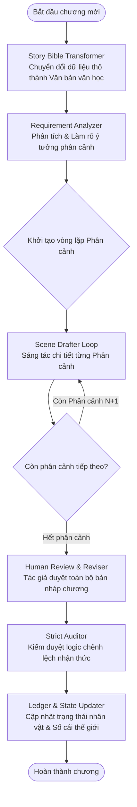

# Trợ lý Sáng tác Truyện dài kỳ Toàn năng (Serial Novel Agent v2)

Hệ thống trợ lý sáng tác truyện chữ dài kỳ (Multi-chapter Serial Novel) sử dụng **LangGraph** để thiết lập quy trình sáng tác phân tầng (Hierarchical Text Generation), tối ưu hóa bộ nhớ ngữ cảnh và kiểm soát nhịp điệu truyện bằng các kỹ thuật văn học nâng cao, kết hợp mô hình ngôn ngữ lớn **Google Gemini**.

---

## 📌 Kiến trúc Cốt lõi & Kỹ thuật Tối ưu

Để khắc phục hiện tượng truyện bị viết vắn tắt, cụt ý và mang phong cách "tóm tắt kịch bản", hệ thống áp dụng 3 kỹ thuật nền tảng:

1. **Sáng tác phân tầng theo Phân cảnh (Scene-by-Scene Looping):**
   * Không bắt LLM viết toàn bộ chương từ một danh sách các sự kiện lớn.
   * Bản đồ sự kiện của chương (các Nodes trong Canvas) được phân rã thành một chuỗi các Phân cảnh (*Scenes*). Đồ thị LangGraph sẽ chạy một vòng lặp tuần tự qua từng phân cảnh.
   * Phân cảnh N sẽ nhận ngữ cảnh trực tiếp từ *toàn bộ văn bản chi tiết* của phân cảnh N-1 liền trước để đảm bảo tính liên tục của mạch cảm xúc, lời thoại và nhịp điệu.

2. **Chuyển đổi dữ liệu sang dạng "Sổ tay tác giả" (Story Bible Transformer):**
   * Trước khi đưa dữ liệu bối cảnh (`meta.json`) và lịch sử truyện (`global_ledger.json`) vào prompt của Writer Agent, một Node trung gian sẽ lọc bỏ các cú pháp kỹ thuật dư thừa (JSON syntax, UUIDs, coordinates).
   * Chuyển đổi thông tin thành định dạng văn bản văn học thuần túy (Narrative Prose / Gạch đầu dòng trực quan) để tối ưu hóa cơ chế chú ý (Attention Mechanism), ngăn ngừa hiện tượng loãng ngữ cảnh (*Lost in the Middle*).

3. **Kiểm soát Cấu trúc và Nhịp độ (Structural Beats & Pacing Control):**
   * Áp dụng nguyên lý **"Show, Don't Tell"** (Hãy thể hiện, đừng kể lể). Định hướng LLM phân bổ nội dung theo tỷ lệ cấu trúc: *Tả cảnh/Không khí -> Biểu cảm/Thái độ -> Đối thoại sinh động -> Hành động thúc đẩy -> Suy nghĩ nội tâm độc thoại*.
   * Tích hợp ràng buộc **Cliffhanger (Kết thúc lửng lơ):** Ép buộc LLM không được giải quyết triệt để xung đột hay đưa ra kết luận đóng ở cuối phân cảnh/chương nhằm duy trì tính tò mò đặc trưng của tiểu thuyết dài kỳ.

---

## 📂 Cấu trúc thư mục dự án

```text
ChapterAgent/
├── main.py               # Giao diện dòng lệnh (CLI) tương tác chính với tác giả
├── requirements.txt      # Khai báo các thư viện phụ thuộc của dự án
├── src/                  # Thư mục chứa mã nguồn chính (Modularized)
│   ├── __init__.py
│   ├── core/             # Cấu hình hệ thống và trạng thái dùng chung
│   │   ├── __init__.py
│   │   ├── config.py     # Quản lý đường dẫn file/thư mục và cấu hình hệ thống
│   │   └── state.py      # Định nghĩa AgentState (trạng thái truyền trong LangGraph)
│   ├── models/           # Định nghĩa cấu trúc dữ liệu Pydantic
│   │   ├── __init__.py
│   │   └── story.py      # Định nghĩa các mô hình CharacterInfo, StoryMeta, GlobalLedger, ChapterState
│   ├── agent/            # Xử lý luồng đi và các Node trong đồ thị LangGraph
│   │   ├── __init__.py
│   │   ├── nodes.py      # Logic xử lý tại các Nodes (Tích hợp CLI và Socket.IO)
│   │   └── graph.py      # Sơ đồ và biên dịch StateGraph
│   ├── api/              # Module chứa API Web server (Flask + Socket.IO)
│   │   ├── __init__.py
│   │   └── app.py        # Định nghĩa các API endpoints và Socket.IO event handlers
│   └── utils/            # Các tiện ích bổ trợ dùng chung
│       ├── __init__.py
│       ├── llm.py        # Quản lý gọi LLM, xử lý lỗi API và tự động thử lại (retry)
│       ├── helpers.py    # Các hàm trợ giúp chuyển đổi kiểu dữ liệu
│       ├── session_manager.py # Quản lý các phiên sáng tác ngầm LangGraph bất đồng bộ
│       └── socket_emitter.py  # Helper phát Socket.IO events tránh import vòng
└── stories/              # Thư mục chứa dữ liệu các bộ truyện đang sáng tác
    └── <story_uuid>/     # Thư mục cụ thể của từng bộ truyện (định danh bằng UUID)
        ├── <uuid>_meta.json            # Cấu hình bối cảnh, nhân vật chính, phong cách...
        ├── <uuid>_global_ledger.json   # Sổ cái toàn cục (timeline, nút thắt chưa giải quyết)
        ├── chapters/                   # Lưu nội dung truyện của các chương
        │   ├── chap_1_content.md
        │   └── chap_2_content.md
        └── states/                     # Lưu chi tiết trạng thái logic của từng chương
            ├── chap_1_state.md
            └── chap_2_state.md
```

---

## ⚙️ Quy trình hoạt động (Workflow)

Hệ thống hoạt động theo một đồ thị trạng thái có hướng và rẽ nhánh điều kiện được xây dựng trên LangGraph:



---


## Quy định chi tiết cho các Nodes chính (Dành cho AI Code Generation)
1. src/utils/context.py (Story Bible Transformer)
Nhiệm vụ: Hàm to_story_bible(meta: dict, ledger: dict) -> str trích xuất thông tin nhân vật, tu vi, pháp khí, địa điểm thành một cẩm nang ngắn gọn bằng văn bản thuần túy.

Loại bỏ: Toàn bộ các dấu ngoặc JSON, UUID, tọa độ Canvas để tránh đánh lừa sự chú ý của mô hình.

2. src/agent/nodes.py -> scene_drafter_node (Vòng lặp Phân cảnh)
Cơ chế bộ nhớ cuốn chiếu: Trạng thái hệ thống (AgentState) phải lưu trữ một danh sách scene_drafts: List[str]. Khi viết phân cảnh N, prompt phải nhận:

## Văn bản Sổ tay tác giả (Story Bible).

Kịch bản chi tiết của phân cảnh N hiện tại.
Toàn bộ văn bản truyện chi tiết của phân cảnh N-1 liền trước (nếu N > 1).
Prompt thiết lập nhịp điệu văn học (Pacing Engine):
Ép buộc triển khai theo mô hình "Show, Don't Tell":
- 30% Thời lượng: Tả cảnh vật, không khí, nhiệt độ, áp lực không gian xung quanh để tạo chiều sâu.
- 20% Thời lượng: Biểu cảm khuôn mặt, ánh mắt, ngôn ngữ cơ thể của các nhân vật trước sự kiện.
- 30% Thời lượng: Hội thoại sinh động, mang đậm cá tính riêng (ví dụ: Sư phụ lười biếng, tếu táo; Nam chính điềm tĩnh, mộc mạc).
- 20% Thời lượng: Hành động thực tế kết hợp suy nghĩ nội tâm độc thoại của nhân vật.

RÀNG BUỘC PHONG CÁCH TRUYỆN DÀI KỲ (SERIAL PACING):
- Tuyệt đối KHÔNG viết tóm tắt hành động nhảy cóc (Ví dụ KHÔNG ĐƯỢC VIẾT: "Sau một hồi chiến đấu, hắn đã thắng"). Phải miêu tả từng đường kiếm, từng nhịp thở.
- Phân cảnh phải kết thúc ở trạng thái mở hoặc một câu thoại lấp lửng, tạo tiền đề chuyển tiếp mượt mà sang phân cảnh kế tiếp.
src/agent/nodes.py -> auditor_node (Kiểm duyệt Logic Đặc thù)
Ngoài kiểm duyệt mâu thuẫn vị trí hay trang bị, Auditor bắt buộc phải quét lỗi "Chênh lệch nhận thức" (Cognitive Dissonance) của Nam chính:

Đảm bảo Nam chính thực sự nghĩ hành động nghịch thiên của mình chỉ là "mẹo vặt nông thôn" bình thường.

Nếu trong bản thảo xuất hiện tình tiết Nam chính cố tình kiêu ngạo, tự đắc hoặc biết mình là cao nhân, Auditor phải đưa ra cảnh báo lỗi logic (ConflictWarning) ngay lập tức để chuyển sang luồng sửa đổi (reviser_node).

4. src/agent/nodes.py -> state_ledger_updater_node (Đồng bộ Sổ cái Toàn cục)
Mục tiêu: Cập nhật chính xác 6 mảng dữ liệu trong global_ledger.json mà không làm thay đổi cấu trúc cũ:

- timeline: Thêm phần tử mới gồm chapter, title, summary, kèm mảng nodes (giữ nguyên cấu trúc chứa id, title, description, characters, resolved_thread, links, locations, weapons, techniques, x, y từ Canvas ban đầu - tuyệt đối loại bỏ thuộc tính content thô của truyện để tối ưu kích thước file) và mảng connections.

- unresolved_threads: Trích xuất các nút thắt mới từ chương hiện tại bằng LLM ({ "thread": str, "chapter": int }). Bảo lưu các nút thắt cũ chưa được giải quyết và giữ nguyên số chương xuất hiện ban đầu của chúng.

- resolved_threads: Di chuyển các nút thắt từ unresolved_threads sang mảng này khi chúng đã được xử lý xong trong chương mới, kèm theo resolution_note và số chương được giải quyết chapter_resolved.

- locations: Quét văn bản chương để tìm địa điểm mới, lưu cấu trúc { "name": str, "chapter": int, "description": str }.

- weapons: Quét văn bản chương để tìm binh khí/pháp khí mới, lưu cấu trúc { "name": str, "chapter": int, "description": str }.

- techniques: Quét văn bản chương để tìm công pháp/chiêu thức mới, lưu cấu trúc { "name": str, "chapter": int, "description": str }.


## 🌐 Danh sách REST APIs & Sự kiện Socket.IO

Dịch vụ Web Flask chạy mặc định trên cổng `5000` phục vụ giao diện ReactJS.

### 1. REST API Endpoints (CRUD)

| Phương thức | Đường dẫn API | Chức năng |
| :--- | :--- | :--- |
| **GET** | `/api/stories` | Lấy danh sách các truyện hiện có |
| **GET** | `/api/stories/<uuid>` | Lấy chi tiết thông tin cấu hình truyện (`meta`) |
| **POST** | `/api/stories` | Tạo mới một câu chuyện |
| **PUT** | `/api/stories/<uuid>` | Cập nhật thông tin cấu hình truyện |
| **GET** | `/api/stories/<uuid>/ledger` | Xem sổ cái cốt truyện (`timeline` & nút thắt) |
| **PUT** | `/api/stories/<uuid>/ledger` | Cập nhật sổ cái thủ công |
| **GET** | `/api/stories/<uuid>/chapters` | Liệt kê các chương và trạng thái file của chúng |
| **GET** | `/api/stories/<uuid>/chapters/<num>`| Xem nội dung (`content`) và trạng thái (`state`) chương |
| **PUT** | `/api/stories/<uuid>/chapters/<num>`| Lưu thay đổi thủ công nội dung chương |
| **DELETE**| `/api/stories/<uuid>/chapters/<num>`| Xóa chương khỏi ổ đĩa và cập nhật timeline sổ cái |
| **POST** | `/api/stories/<uuid>/chapters/generate`| Kích hoạt tiến trình sáng tác chương tiếp theo trong background thread |

### 2. Sự kiện Socket.IO (Real-time Events)

Hỗ trợ đồng bộ hóa dữ liệu hai chiều bất đồng bộ khi đang chạy LangGraph:

* **Server phát đi (Emits):**
  * `agent_status`: Gửi tiến trình hiện tại. Data: `{ story_uuid, chapter_num, status, message }`
    * Các trạng thái (`status`): `analyzing_requirements`, `drafting`, `waiting_review`, `revising`, `auditing`, `updating`, `completed`, `error`.
  * `clarify_requirements`: Yêu cầu làm rõ ý tưởng khi phát hiện thiếu thông tin. Data: `{ story_uuid, chapter_num, questions: [] }`
  * `draft_review_needed`: Gửi bản viết nháp để tác giả duyệt và nhận ý kiến đóng góp. Data: `{ story_uuid, chapter_num, draft_content }`
  * `audit_warnings`: Gửi các cảnh báo logic phát hiện được sau bước kiểm duyệt. Data: `{ story_uuid, chapter_num, warnings: [], feedback }`

* **Client gửi lên (Listens):**
  * `submit_clarification`: Gửi câu trả lời làm rõ yêu cầu. Data: `{ story_uuid, answers }`
  * `submit_review_feedback`: Gửi nhận xét sửa đổi nháp truyện (hoặc gửi từ khóa `"Done"` để đồng ý đi tiếp). Data: `{ story_uuid, feedback }`

---

## 🚀 Hướng dẫn Cài đặt & Sử dụng

### 1. Chuẩn bị môi trường
Yêu cầu hệ thống đã cài đặt Python (phiên bản khuyến nghị từ 3.10 trở lên).

Cài đặt các thư viện phụ thuộc vào môi trường ảo `.venv`:
```bash
# Tạo môi trường ảo (nếu chưa có)
python -m venv .venv
# Hoặc dùng uv:
uv venv

# Cài đặt thư viện phụ thuộc
.\.venv\Scripts\pip install -r requirements.txt
# Hoặc dùng uv:
uv pip install -r requirements.txt
```

### 2. Thiết lập cấu hình
Tạo file `.env` tại thư mục gốc của dự án và điền khóa API Gemini của bạn:
```env
GOOGLE_API_KEY=your_gemini_api_key_here
```

### 3. Các lệnh chạy chính (sử dụng Python trong `.venv`)

* **Khởi chạy Flask Web API & Socket.IO server (Dành cho giao diện ReactJS):**
  ```powershell
  .\.venv\Scripts\python.exe main.py serve --port 5000
  # Hoặc:
  .\.venv\Scripts\python.exe main.py serve --port 5000 --host 127.0.0.1
  ```

* **Khởi tạo truyện mới (Dòng lệnh CLI):**
  ```powershell
  .\.venv\Scripts\python.exe main.py init
  ```

* **Sáng tác chương tiếp theo (Dòng lệnh CLI):**
  ```powershell
  .\.venv\Scripts\python.exe main.py write
  ```

* **Xem sổ cái của truyện (Dòng lệnh CLI):**
  ```powershell
  .\.venv\Scripts\python.exe main.py ledger
  ```

* **Thay đổi model AI sử dụng cho truyện (Dòng lệnh CLI):**
  ```powershell
  .\.venv\Scripts\python.exe main.py set-model
  ```
