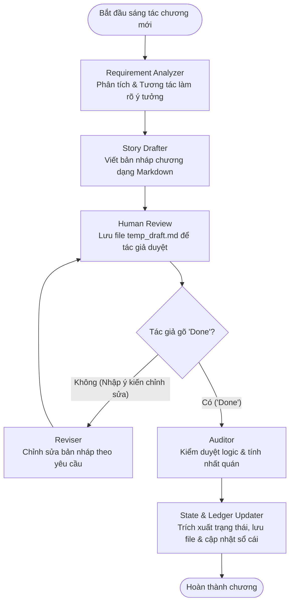

# Trợ lý Sáng tác Truyện dài kỳ (Serial Novel Agent) với LangGraph & Gemini

Hệ thống trợ lý sáng tác truyện dài kỳ (chương hồi) sử dụng **LangGraph** để xây dựng quy trình sáng tác nhiều bước (multi-step workflow) kết hợp sự phản hồi của con người (Human-in-the-loop) và mô hình ngôn ngữ lớn **Google Gemini** nhằm đảm bảo chất lượng văn phong, tính liên tục và tính nhất quán logic của toàn bộ tác phẩm.

---

## 📌 Mục đích dự án

Khi viết một bộ truyện dài kỳ (ví dụ: tiểu thuyết mạng, truyện chữ nhiều chương), tác giả thường gặp phải các vấn đề lớn:
1. **Thiếu nhất quán logic:** Quên mất chi tiết ở các chương trước (ví dụ: nhân vật ở chương 2 đã mất kiếm nhưng chương 5 lại rút kiếm chiến đấu; nhân vật đã đi xa nhưng chương sau bỗng xuất hiện trong thành mà không có dẫn dắt).
2. **Quản lý cốt truyện phức tạp:** Khó theo dõi các mối nối, bí ẩn, hoặc nút thắt cốt truyện chưa được giải quyết (*unresolved threads*).
3. **Mất kiểm soát văn phong:** AI viết truyện thường dễ bị lạc tông giọng (*style/tone*) hoặc viết quá chung chung, thiếu miêu tả nội tâm sâu sắc.

Dự án này được thiết kế để giải quyết những thách thức trên bằng cách cung cấp một quy trình sáng tác khép kín:
* **Phân tích ý tưởng chủ động:** Phân tích ý tưởng của tác giả, tự động hỏi lại nếu thiếu thông tin cốt lõi để hoàn thiện đề cương chi tiết cho chương.
* **Biên tập & Chỉnh sửa tương tác:** Lưu bản nháp vào file tạm để tác giả tự do chỉnh sửa và đưa phản hồi lặp đi lặp lại cho đến khi ưng ý.
* **Kiểm duyệt logic nghiêm ngặt (Audit):** Đối chiếu bản viết với sổ cái toàn cục và trạng thái chương trước để đưa ra cảnh báo mâu thuẫn cốt truyện.
* **Tự động hóa quản lý trạng thái:** Tự động trích xuất tóm tắt chương, cập nhật trạng thái nhân vật (vị trí, hành trang, sức khỏe), phát hiện nhân vật mới và cập nhật sổ cái câu chuyện.

---

## 📂 Cấu trúc thư mục dự án

```text
ChapterAgent/
├── config.py             # Cấu hình các đường dẫn file và thư mục lưu trữ dữ liệu
├── models.py             # Định nghĩa cấu trúc dữ liệu Pydantic (Meta, Ledger, State)
├── state.py              # Định nghĩa AgentState (trạng thái truyền trong LangGraph)
├── nodes.py              # Xử lý logic tại các bước (nodes) trong đồ thị
├── graph.py              # Thiết lập cấu trúc đồ thị StateGraph và rẽ nhánh điều kiện
├── main.py               # Giao diện dòng lệnh (CLI) tương tác chính với tác giả
├── requirements.txt      # Khai báo các thư viện phụ thuộc của dự án
└── stories/              # Thư mục chứa dữ liệu các bộ truyện đang sáng tác
    └── <story_uuid>/     # Thư mục cụ thể của từng bộ truyện (định danh bằng UUID)
        ├── <uuid>_meta.json            # Cấu hình bối cảnh, nhân vật chính, phong cách...
        ├── <uuid>_global_ledger.json   # Sổ cái toàn cục (timeline, nút thắt chưa giải quyết)
        ├── chapters/                   # Lưu nội dung truyện của các chương
        │   ├── chap_1_content.md
        │   └── chap_2_content.md
        └── states/                     # Lưu chi tiết trạng thái logic của từng chương
            ├── chap_1_state.md
            └── chap_2_state.md
```

---

## ⚙️ Quy trình hoạt động (Workflow)

Hệ thống hoạt động theo một đồ thị trạng thái có hướng và rẽ nhánh điều kiện được xây dựng trên LangGraph:



---

## 🛠️ Chức năng các Module và Lớp trong dự án

### 1. `config.py`
Module quản lý cấu hình hệ thống và tạo lập môi trường.
* **Mục đích:** Cung cấp giải pháp đường dẫn động để quản lý độc lập nhiều tác phẩm khác nhau.
* **Chức năng chính:**
  * Xác định thư mục gốc (`BASE_DIR`) và thư mục chứa truyện (`STORIES_DIR`).
  * Định vị file nháp tạm `temp_draft.md` dùng cho quá trình duyệt của tác giả.
  * Cung cấp các hàm tạo thư mục và lấy đường dẫn file tự động: `get_story_dir()`, `get_chapters_dir()`, `get_states_dir()`, `get_meta_path()`, `get_ledger_path()`, `get_chapter_content_path()`, `get_chapter_state_path()`.
  * Hàm `check_api_key()` kiểm tra xem tác giả đã cài đặt khóa API Gemini hay chưa.

### 2. `models.py`
Chứa các lớp cấu trúc dữ liệu chính kế thừa từ `pydantic.BaseModel` để đảm bảo dữ liệu luôn được chuẩn hóa và dễ dàng chuyển đổi qua lại với định dạng JSON.
* **`CharacterInfo`**:
  * Lưu trữ thông tin chi tiết về từng nhân vật bao gồm: Tên (`name`), vai trò trong truyện (`role`), mô tả đặc điểm, ngoại hình, tính cách (`description`), chương xuất hiện đầu tiên (`first_chapter`) và hoàn cảnh gặp gỡ đầu tiên (`appearance_context`).
* **`StoryMeta`**:
  * Quản lý metadata toàn cục của bộ truyện: Định danh duy nhất (`uuid`), tên tác phẩm (`name`), danh sách nhân vật chính (`characters`), bối cảnh thế giới/cốt truyện chung (`context`), phong cách kể chuyện (`style`), các thẻ nhãn phân loại (`tags`), số chương tối đa dự kiến (`max_chapters`), giới hạn từ mỗi chương (`max_words_per_chapter`), và model AI được chỉ định (`model`).
* **`GlobalLedger`**:
  * Đóng vai trò là "cuốn sổ cái" ghi chép lịch sử diễn biến. Gồm:
    * `timeline`: Danh sách các chương đã viết, mỗi chương gồm số chương, tiêu đề chương, và tóm tắt ngắn gọn.
    * `unresolved_threads`: Danh sách các nút thắt, bí ẩn hoặc manh mối chưa được giải quyết trong mạch truyện chung.
* **`ChapterState`**:
  * Trạng thái chi tiết ngay sau khi một chương kết thúc: Tiêu đề chương (`chapter_title`), tóm tắt chi tiết (`summary`), trạng thái hiện tại của từng nhân vật (`character_statuses` - vị trí, chấn thương, tâm lý...), các nút thắt đã được giải quyết (`threads_resolved`) và các nút thắt mới mở ra (`threads_introduced`).

### 3. `state.py`
* **`AgentState`** (kế thừa từ `TypedDict`):
  * Cấu trúc lưu trữ trạng thái chạy trong suốt vòng đời của đồ thị LangGraph. State này lưu giữ toàn bộ dữ liệu cần thiết của chương hiện tại như: `story_uuid`, `chapter_num`, `user_idea`, `model`, các thông tin meta và ledger tải từ file lên, bản phân tích yêu cầu, nội dung nháp, phản hồi chỉnh sửa của con người, các cảnh báo mâu thuẫn từ kiểm duyệt viên, và cờ báo hoàn thành `is_done`.

### 4. `nodes.py`
Module quan trọng nhất chứa mã nguồn xử lý logic của từng Node trong đồ thị và các tiện ích hỗ trợ API.
* **Cơ chế xử lý lỗi API thông minh:**
  * `classify_exception()`: Phân loại lỗi trả về từ thư viện Google Gemini API thành các mã trạng thái HTTP tiêu chuẩn (401 - Lỗi xác thực, 429 - Quá tải lưu lượng, 5xx - Lỗi máy chủ).
  * `invoke_with_retry()`: Gọi API với cơ chế tự động thử lại. Đặc biệt:
    * Khi gặp lỗi xác thực API Key (401/403), chương trình sẽ tạm dừng và yêu cầu tác giả nhập key mới trực tiếp từ console, sau đó tự động ghi đè vào `.env` để tiếp tục.
    * Khi gặp lỗi quá tải (429) hoặc lỗi hệ thống Google (5xx), chương trình sẽ đếm ngược chờ thử lại hoặc cho phép tác giả nhanh chóng chuyển sang một model khác (như chuyển từ `gemini-1.5-flash` sang `gemini-2.5-flash`) ngay lập tức mà không làm mất tiến trình viết chương.
* **Chi tiết các Nodes:**
  * **`requirement_analyzer_node`**: Đối chiếu ý tưởng của tác giả với sổ cái toàn cục và chương trước. Nếu phát hiện thiếu thông tin cốt lõi (động cơ nhân vật, cách thức giải quyết mâu thuẫn...), Node sẽ đưa ra các câu hỏi tương tác yêu cầu tác giả bổ sung trực tiếp tại terminal. Cuối cùng, tổng hợp thành một bản phân tích yêu cầu chi tiết.
  * **`story_drafter_node`**: Đóng vai trò là nhà văn mạng, kết hợp cấu hình cốt truyện, bối cảnh, văn phong, sổ cái lịch sử, và tham khảo 2000 ký tự cuối của chương trước để viết nên bản nháp chương mới một cách liền mạch, mượt mà dưới dạng Markdown.
  * **`human_review_node`**: Lưu bản nháp vào file `temp_draft.md` trong thư mục dự án và đưa ra thông báo. Tác giả mở file bằng Text Editor bất kỳ để chỉnh sửa hoặc đọc kiểm tra, sau đó phản hồi lại yêu cầu chỉnh sửa hoặc nhập `Done` tại terminal để đi tiếp.
  * **`reviser_node`**: Biên tập lại nội dung dựa trên ý kiến chỉnh sửa của tác giả và bản nháp trước đó mà không làm ảnh hưởng đến logic bối cảnh chung.
  * **`auditor_node`**: Đóng vai trò là biên tập viên kiểm duyệt cốt truyện độc lập. Đối chiếu bản nháp với trạng thái chương trước và sổ cái toàn cục để phát hiện các lỗi logic (như vị trí địa lý sai lệch, trạng thái vật phẩm mâu thuẫn, nhân vật thay đổi quan hệ đột ngột...). Trả về danh sách cảnh báo `warnings` và nhận xét.
  * **`state_ledger_updater_node`**: Trích xuất dữ liệu chương mới để tạo `ChapterState`. Lưu file nội dung truyện (`chap_x_content.md`), file trạng thái logic (`chap_x_state.md`). Cập nhật sổ cái toàn cục (thêm vào timeline và lọc cập nhật các nút thắt chưa giải quyết). Đồng thời, tự động quét phát hiện các nhân vật mới xuất hiện trong chương để cập nhật vào file cấu hình `meta.json`. Cuối cùng, dọn dẹp file nháp tạm `temp_draft.md`.

### 5. `graph.py`
* **Mục đích:** Khai báo và biên dịch đồ thị LangGraph.
* **Chức năng chính:**
  * Khởi tạo `StateGraph(AgentState)`.
  * Đăng ký các hàm node từ `nodes.py` vào đồ thị.
  * Thiết lập luồng chạy cố định: `Requirement Analyzer` ➔ `Story Drafter` ➔ `Human Review`.
  * Thiết lập liên kết rẽ nhánh có điều kiện (`Conditional Edge`) sau bước `Human Review` thông qua hàm `route_after_human_review(state)`: Nếu nhận phản hồi là `"done"`, chuyển tiếp đến `Auditor` ➔ `Updater` ➔ `END`; nếu nhận phản hồi chỉnh sửa, quay trở lại node `Reviser` ➔ `Human Review` để lặp lại chu kỳ biên tập.

### 6. `main.py`
* **Mục đích:** Điểm khởi đầu của ứng dụng, chịu trách nhiệm xử lý các tham số dòng lệnh CLI và tương tác trực tiếp với người dùng.
* **Các lệnh chính:**
  * `python main.py init`: Khởi tạo tác phẩm mới (nhập tên, bối cảnh, văn phong, các thẻ tag, cấu hình giới hạn và thêm danh sách các nhân vật chính ban đầu).
  * `python main.py list`: Liệt kê tất cả các truyện hiện có dưới dạng bảng thông tin trực quan.
  * `python main.py write [--uuid UUID] [--model MODEL]`: Sáng tác chương tiếp theo. Nếu không truyền `uuid`, chương trình sẽ hiển thị danh sách để tác giả chọn. Lệnh này sẽ tự động xác định số chương tiếp theo cần viết, tải dữ liệu lịch sử và khởi chạy đồ thị LangGraph.
  * `python main.py ledger [--uuid UUID]`: Xem chi tiết sổ cái toàn cục bao gồm danh sách các nút thắt chưa giải quyết và dòng thời gian tóm tắt của các chương trước.
  * `python main.py meta [--uuid UUID]`: Xem thông tin cấu hình bối cảnh, phong cách và danh sách nhân vật chi tiết của tác phẩm.
  * `python main.py set-model [--uuid UUID] [--model MODEL]`: Thay đổi model AI sử dụng cho tác phẩm.

---

## 🚀 Hướng dẫn Cài đặt & Sử dụng

### 1. Chuẩn bị môi trường
Yêu cầu hệ thống đã cài đặt Python (phiên bản khuyến nghị từ 3.10 trở lên) hoặc công cụ quản lý package Python cực nhanh `uv`.

Cài đặt các thư viện phụ thuộc:
```bash
pip install -r requirements.txt
# Hoặc nếu sử dụng uv:
uv pip install -r requirements.txt
```

### 2. Thiết lập cấu hình
Tạo file `.env` tại thư mục gốc của dự án và điền khóa API Gemini của bạn:
```env
GOOGLE_API_KEY=your_gemini_api_key_here
```

### 3. Các lệnh chạy chính
* **Khởi tạo truyện mới:**
  ```bash
  python main.py init
  ```
  Nhập các thông tin theo hướng dẫn trên màn hình. Sau khi hoàn tất, hệ thống sẽ cấp một mã UUID duy nhất cho truyện của bạn.

* **Sáng tác chương tiếp theo:**
  ```bash
  python main.py write
  ```
  Chọn bộ truyện muốn viết, nhập ý tưởng sơ bộ của bạn và thực hiện quy trình duyệt bản nháp tương tác tại terminal.

* **Xem sổ cái của truyện:**
  ```bash
  python main.py ledger
  ```

* **Thay đổi model AI sử dụng cho truyện:**
  ```bash
  python main.py set-model
  ```
