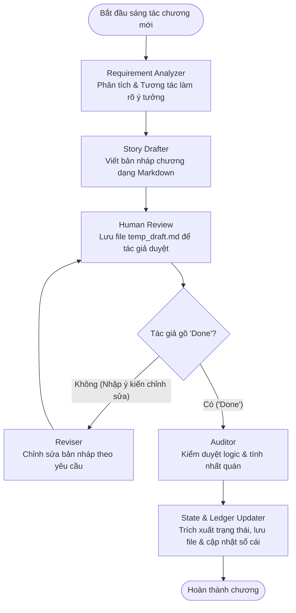

# Trợ lý Sáng tác Truyện dài kỳ (Serial Novel Agent) với LangGraph & Gemini

Hệ thống trợ lý sáng tác truyện dài kỳ (chương hồi) sử dụng **LangGraph** để xây dựng quy trình sáng tác nhiều bước (multi-step workflow) kết hợp sự phản hồi của con người (Human-in-the-loop) và mô hình ngôn ngữ lớn **Google Gemini** nhằm đảm bảo chất lượng văn phong, tính liên tục và tính nhất quán logic của toàn bộ tác phẩm.

---

## 📌 Mục đích dự án

Khi viết một bộ truyện dài kỳ (ví dụ: tiểu thuyết mạng, truyện chữ nhiều chương), tác giả thường gặp phải các vấn đề lớn:
1. **Thiếu nhất quán logic:** Quên mất chi tiết ở các chương trước (ví dụ: nhân vật ở chương 2 đã mất kiếm nhưng chương 5 lại rút kiếm chiến đấu; nhân vật đã đi xa nhưng chương sau bỗng xuất hiện trong thành mà không có dẫn dắt).
2. **Quản lý cốt truyện phức tạp:** Khó theo dõi các mối nối, bí ẩn, hoặc nút thắt cốt truyện chưa được giải quyết (*unresolved threads*).
3. **Mất kiểm soát văn phong:** AI viết truyện thường dễ bị lạc tông giọng (*style/tone*) hoặc viết quá chung chung, thiếu miêu tả nội tâm sâu sắc.

Dự án này được thiết kế để giải quyết những thách thức trên bằng cách cung cấp một quy trình sáng tác khép kín:
* **Phân tích ý tưởng chủ động:** Phân tích ý tưởng của tác giả, tự động hỏi lại nếu thiếu thông tin cốt lõi để hoàn thiện đề cương chi tiết cho chương.
* **Biên tập & Chỉnh sửa tương tác:** Lưu bản nháp vào file tạm để tác giả tự do chỉnh sửa và đưa phản hồi lặp đi lặp lại cho đến khi ưng ý.
* **Kiểm duyệt logic nghiêm ngặt (Audit):** Đối chiếu bản viết với sổ cái toàn cục và trạng thái chương trước để đưa ra cảnh báo mâu thuẫn cốt truyện.
* **Tự động hóa quản lý trạng thái:** Tự động trích xuất tóm tắt chương, cập nhật trạng thái nhân vật (vị trí, hành trang, sức khỏe), phát hiện nhân vật mới và cập nhật sổ cái câu chuyện.

---

## 📂 Cấu trúc thư mục dự án

```text
ChapterAgent/
├── main.py               # Giao diện dòng lệnh (CLI) tương tác chính với tác giả
├── requirements.txt      # Khai báo các thư viện phụ thuộc của dự án
├── src/                  # Thư mục chứa mã nguồn chính (Modularized)
│   ├── __init__.py
│   ├── core/             # Cấu hình hệ thống và trạng thái dùng chung
│   │   ├── __init__.py
│   │   ├── config.py     # Quản lý đường dẫn file/thư mục và cấu hình hệ thống
│   │   └── state.py      # Định nghĩa AgentState (trạng thái truyền trong LangGraph)
│   ├── models/           # Định nghĩa cấu trúc dữ liệu Pydantic
│   │   ├── __init__.py
│   │   └── story.py      # Định nghĩa các mô hình CharacterInfo, StoryMeta, GlobalLedger, ChapterState
│   ├── agent/            # Xử lý luồng đi và các Node trong đồ thị LangGraph
│   │   ├── __init__.py
│   │   ├── nodes.py      # Logic xử lý tại các Nodes
│   │   └── graph.py      # Sơ đồ và biên dịch StateGraph
│   └── utils/            # Các tiện ích bổ trợ dùng chung
│       ├── __init__.py
│       ├── llm.py        # Quản lý gọi LLM, xử lý lỗi API và tự động thử lại (retry)
│       └── helpers.py    # Các hàm trợ giúp chuyển đổi kiểu dữ liệu
└── stories/              # Thư mục chứa dữ liệu các bộ truyện đang sáng tác
    └── <story_uuid>/     # Thư mục cụ thể của từng bộ truyện (định danh bằng UUID)
        ├── <uuid>_meta.json            # Cấu hình bối cảnh, nhân vật chính, phong cách...
        ├── <uuid>_global_ledger.json   # Sổ cái toàn cục (timeline, nút thắt chưa giải quyết)
        ├── chapters/                   # Lưu nội dung truyện của các chương
        │   ├── chap_1_content.md
        │   └── chap_2_content.md
        └── states/                     # Lưu chi tiết trạng thái logic của từng chương
            ├── chap_1_state.md
            └── chap_2_state.md
```

---

## ⚙️ Quy trình hoạt động (Workflow)

Hệ thống hoạt động theo một đồ thị trạng thái có hướng và rẽ nhánh điều kiện được xây dựng trên LangGraph:



---

## 🛠️ Chức năng các Module và Lớp trong dự án

### 1. Thư mục `src/core/`
* **[src/core/config.py](file:///e:/Chapter/ChapterAgent/src/core/config.py)**:
  * Quản lý các biến cấu hình thư mục: `BASE_DIR`, `STORIES_DIR`, `TEMP_DRAFT_PATH`.
  * Cung cấp các hàm tạo thư mục và lấy đường dẫn file tự động dựa trên mã truyện: `get_story_dir()`, `get_chapters_dir()`, `get_states_dir()`, `get_meta_path()`, `get_ledger_path()`, `get_chapter_content_path()`, `get_chapter_state_path()`.
  * Hàm `check_api_key()` kiểm tra sự tồn tại của khóa API Gemini.
* **[src/core/state.py](file:///e:/Chapter/ChapterAgent/src/core/state.py)**:
  * Định nghĩa `AgentState` (kế thừa từ `TypedDict`): Lưu trữ toàn bộ thông tin trạng thái chạy trong suốt vòng đời của đồ thị (uuid truyện, số chương, ý tưởng tác giả, văn bản bản nháp, phản hồi ý kiến...).

### 2. Thư mục `src/models/`
* **[src/models/story.py](file:///e:/Chapter/ChapterAgent/src/models/story.py)**:
  * Kế thừa từ `pydantic.BaseModel` để đảm bảo dữ liệu luôn được chuẩn hóa và kiểm tra kiểu chặt chẽ:
    * `CharacterInfo`: Lưu thông tin chi tiết từng nhân vật (tên, vai trò, mô tả, chương gặp lần đầu...).
    * `StoryMeta`: Metadata toàn cục của truyện (tên tác phẩm, bối cảnh thế giới, phong cách viết, model AI...).
    * `GlobalLedger`: Lưu dòng thời gian cốt truyện (`timeline`) và các bí ẩn chưa giải quyết (`unresolved_threads`).
    * `ChapterState`: Trạng thái chi tiết tại một chương (tóm tắt chương, trạng thái từng nhân vật sau chương, nút thắt được gỡ hoặc mở ra).

### 3. Thư mục `src/utils/`
* **[src/utils/helpers.py](file:///e:/Chapter/ChapterAgent/src/utils/helpers.py)**:
  * Cung cấp các tiện ích xử lý định dạng chuỗi, đặc biệt là `ensure_string` đảm bảo câu trả lời từ các mô hình AI khác nhau luôn ở dạng chuỗi văn bản sạch.
* **[src/utils/llm.py](file:///e:/Chapter/ChapterAgent/src/utils/llm.py)**:
  * Quản lý khởi tạo mô hình Chat Google Gemini (`get_llm`).
  * `classify_exception()`: Phân loại ngoại lệ API thành mã lỗi HTTP tương ứng để chuẩn bị phản ứng (401 - Lỗi API Key, 429 - Vượt hạn mức, 5xx - Lỗi máy chủ).
  * `invoke_with_retry()`: Gọi API thông minh. Khi gặp lỗi 401/403, tạm dừng và yêu cầu tác giả cập nhật API Key mới ngay trên terminal; khi gặp lỗi 429 hoặc 5xx, cho phép đổi model AI sử dụng (ví dụ chuyển từ `gemini-1.5-flash` sang `gemini-2.5-flash`) lập tức để tiếp tục luồng viết truyện.

### 4. Thư mục `src/agent/`
* **[src/agent/nodes.py](file:///e:/Chapter/ChapterAgent/src/agent/nodes.py)**:
  * `requirement_analyzer_node`: Phân tích ý tưởng và tương tác đặt câu hỏi làm rõ đề cương chương truyện.
  * `story_drafter_node`: Đóng vai trò là nhà văn mạng viết nháp chương truyện Markdown (tham chiếu 2000 ký tự cuối chương trước).
  * `human_review_node`: Lưu file `temp_draft.md` để tác giả mở chỉnh sửa và nhận phản hồi.
  * `reviser_node`: Biên tập và viết lại truyện dựa trên ý kiến chỉnh sửa.
  * `auditor_node`: Kiểm duyệt lỗi logic (nhất quán cốt truyện) và đưa ra các cảnh báo cụ thể.
  * `state_ledger_updater_node`: Cập nhật file trạng thái, file nội dung, timeline sổ cái, và tự động quét cập nhật nhân vật mới phát hiện vào file meta.
* **[src/agent/graph.py](file:///e:/Chapter/ChapterAgent/src/agent/graph.py)**:
  * Xây dựng đồ thị `StateGraph`, đăng ký các node và thiết lập đường đi. Định nghĩa rẽ nhánh có điều kiện `route_after_human_review` để quyết định quay lại sửa đổi hay đi tiếp tới kiểm duyệt.

### 5. File `main.py` ở thư mục gốc
CLI entrypoint xử lý dòng lệnh của tác giả. Tích hợp các chức năng:
* `init`: Khởi tạo câu chuyện mới.
* `list`: Liệt kê các tác phẩm đang viết.
* `write`: Sáng tác chương kế tiếp.
* `ledger`: Xem dòng thời gian cốt truyện và các nút thắt của tác phẩm.
* `meta`: Xem thông tin chi tiết cấu hình truyện.
* `set-model`: Thay đổi model AI mặc định của truyện.

---

## 🚀 Hướng dẫn Cài đặt & Sử dụng

### 1. Chuẩn bị môi trường
Yêu cầu hệ thống đã cài đặt Python (phiên bản khuyến nghị từ 3.10 trở lên).

Cài đặt các thư viện phụ thuộc vào môi trường ảo `.venv`:
```bash
# Tạo môi trường ảo (nếu chưa có)
python -m venv .venv
# Hoặc dùng uv:
uv venv

# Cài đặt thư viện phụ thuộc
.\.venv\Scripts\pip install -r requirements.txt
# Hoặc dùng uv:
uv pip install -r requirements.txt
```

### 2. Thiết lập cấu hình
Tạo file `.env` tại thư mục gốc của dự án và điền khóa API Gemini của bạn:
```env
GOOGLE_API_KEY=your_gemini_api_key_here
```

### 3. Các lệnh chạy chính (sử dụng Python trong `.venv`)
* **Khởi tạo truyện mới:**
  ```powershell
  .\.venv\Scripts\python.exe main.py init
  ```
  Nhập các thông tin theo hướng dẫn trên màn hình. Sau khi hoàn tất, hệ thống sẽ cấp một mã UUID duy nhất cho truyện.

* **Sáng tác chương tiếp theo:**
  ```powershell
  .\.venv\Scripts\python.exe main.py write
  ```
  Chọn bộ truyện muốn viết, nhập ý tưởng sơ bộ của bạn và thực hiện quy trình duyệt bản nháp tương tác tại terminal.

* **Xem sổ cái của truyện:**
  ```powershell
  .\.venv\Scripts\python.exe main.py ledger
  ```

* **Thay đổi model AI sử dụng cho truyện:**
  ```powershell
  .\.venv\Scripts\python.exe main.py set-model
  ```
